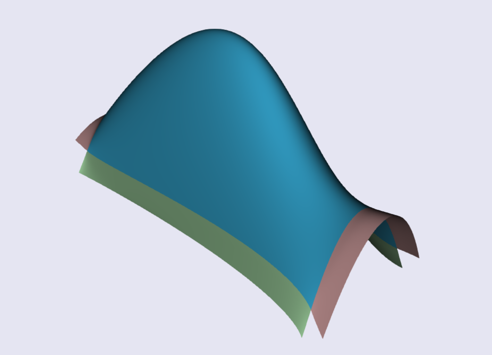
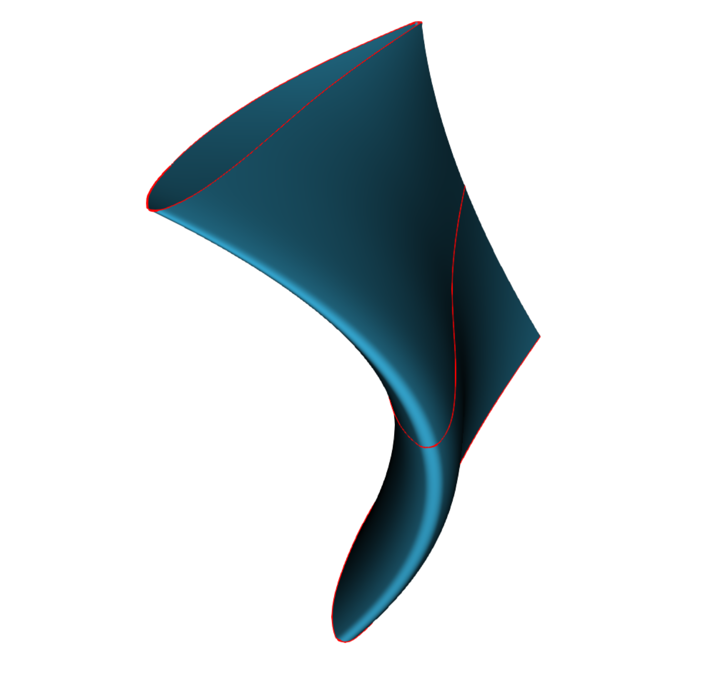

# GBS Release Notes
22 may 2021
* add curve and surfaces extension
* add surfaces of revolution
* add igest export support
* many fixes and improvements

11 apr 2021
* curves creation from json
* transfinite mesh
* curvature base discretization
* curvilinear abscissa
* curve reparametrization
* cn curves connections
* surface approximation
* curves 2d offset
30 nov 2020
* Add many utilities to connect and join curves.
* Improve render configuration.
* Put everything together to build advanced shape

31 oct 2020
* Loft surface creation

12 oct 2020
* Start python biding

08 oct 2020
* Geometries have now a 3d visualization

01 oct 2020
* Initial public release.