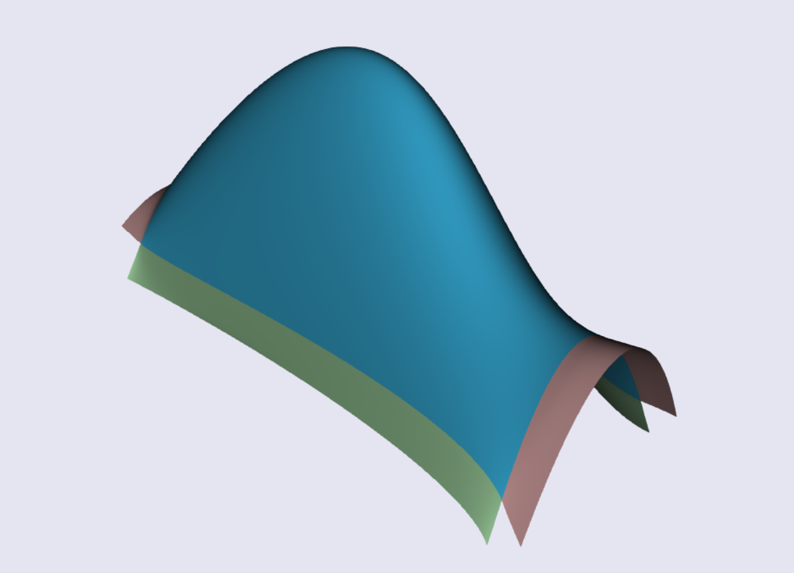
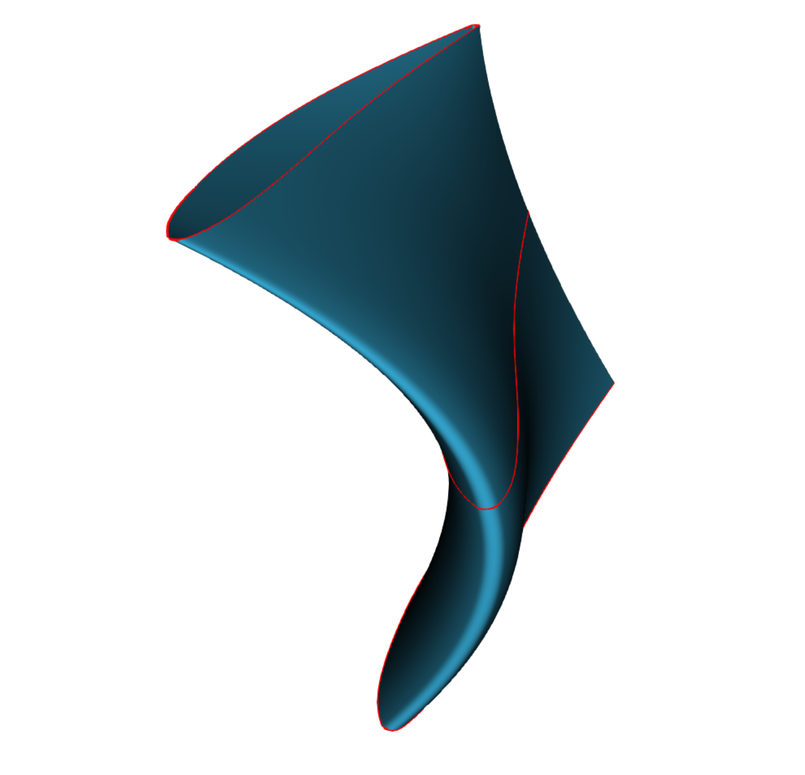

# GBS Release Notes
Unreleased

Build / tooling
* the legacy topology classes `BaseTopo`, `Vertex`, `Edge`, `Wire` of `inc/topology/` are deprecated in favour of `gbs::brep`
* the library now requires C++23 (was C++20): `CMAKE_CXX_STANDARD 23`. Supported toolchains are those of the CI (clang >= 19, MSVC 2022, AppleClang >= 17); the library-only C++23 features that Apple libc++ lacks (`std::flat_map`, `std::print`, `std::mdspan`) are not used

New features
* `gbs-brep` (stage 1 of the native BREP core, design in `docs/sources/design/brep_core.md`): `gbs::brep::Model<T>` arena with typed identifiers (`Id<ShapeType>`: `VertexId`, `EdgeId`, …) and the BREP entities (`Vertex`, `Edge`, `CoEdge`, `Wire`, `Face`, `FaceUse`, `Shell`, `Solid`, `Compound`), orientation by usage, pcurves per co-edge, per-entity tolerances; `erase` / `compact` / `append`; constants `brep_default_tolerance` and `brep_pcurve_approx_tol` in `gbs/gbsconstants.h`
* `gbs-brep/explore.h`: `explore(model, shape)` (sub-entities by type, no duplicate), `TopologyIndex` (faces / co-edges of an edge, edges of a vertex, shells of a face), wire `is_closed` / `is_chained`, shell `is_closed` / `is_manifold` / `is_orientable` / `free_edges` / `non_manifold_edges` / `shell_edge_uses`, `bounding_box` with a `BoundingBox` type
* `gbs-brep/builders.h`: `make_vertex`, `make_edge` (curve with or without bounds, two points, two vertices, curve ending on given vertices), `make_degenerate_edge`, `make_wire` (edges in any order and sense, vertex merge within tolerance, open or closed chain); builders return `BuildResult<Id>` = `std::expected<Id, BuildError>` and leave the model unchanged on failure, `unwrap()` throws `BRepError`
* `gbs-brep`: `make_face(model, surface)` builds a face on the whole parametric rectangle, with seam edges (cylinder, full revolution, torus) and degenerate edges (sphere poles, cone apex), exact `CurveOnSurface` edges and degree-1 pcurves; `surface_closure` (numeric closure / degeneracy of the four boundary isos) and `uv_signed_area` in `gbs-brep/closure.h`
* `arc_length_distrib_params`: curve parameters at prescribed normalized arc lengths, given as a list or as a law s(ξ) of the node index fraction ξ = i / (n − 1) (tanh, geometric… clustering in length on the original curve, without re-interpolating it); `uniform_distrib_params` is the law s(ξ) = ξ. Python bindings for both forms

v0.5.1 — 30 sep 2026

Fixes
* MSVC builds no longer force `/fp:fast /arch:AVX2` (#109): `/fp:fast` broke the robust geometric predicates (`orient2d`) used by the Delaunay mesher, and `/arch:AVX2` made the binaries require an AVX2 CPU. MSVC keeps its defaults (`/fp:precise`, SSE2); `GBS_MSVC_FAST_MATH=ON` restores the old flags for local builds
* CI builds and tests with MSVC on Windows, like the conda-forge win-64 package

v0.5.0 — 29 sep 2026

Behaviour changes
* loft: the skin-direction (v) parameters now default to the averaged chord-length of NURBS Book §10.3 instead of a uniform parametrization (#71) — lofted surfaces differ from 0.4.x for the same input
* `find_span` now follows NURBS Book A2.1 exactly (half-open convention `k[s] <= u < k[s+1]`, #42/#46): correct one-sided derivatives at knots of multiplicity > 1

Performance
* evaluation: allocation-free O(p²) evaluator and one-pass multi-order derivatives (#30); span reduction enabled for derivatives (~12x faster curve derivatives); per-call eval ~4x faster than OCCT
* bulk evaluators are parallel above a size threshold (#88, 12–30x over OCCT's scalar loop); grid sampling (`offset_points`, surface `discretize`) pre-sized and parallel (#89)
* Python: bulk evaluators return numpy arrays without copy (#97, ~10x at 1M points)
* interpolation: banded / sparse / separable solves (#34), then direct band assembly + no-pivot band LU (#96): ~10x on an 800-point build, now faster than OCCT and scipy at every tested size
* approximation: banded one-pass assembly and structured least-squares solve (#65, 2.5–9x vs OCCT)
* loft: v-system factorized once, batched pole solves (#40)
* new `build_batch` (`gbs/execution.h`): builds N independent interpolations/approximations in parallel, exceptions propagated to the caller (#91)
* mesh: `elliptic_structured_smoothing` sweeps rows in parallel, bit-identical to the serial loop (#90, 5x at 10k and 16x at 1M interior vertices on 64 cores)

New features
* degree reduction (NURBS Book A5.11, #78): `BSCurve::reduceDegree(tol)`, `BSSurface::reduceDegreeU/V(tol)` return (success, rigorous error bound) and leave the geometry untouched when not reducible within `tol`; Python bindings, plus `BSSurface.increaseDegreeU/V`
* hodograph (NURBS Book A3.3, #83): `derivative_curve(crv, k)` returns the k-th derivative of a non-rational curve as a `BSCurve` (C++ and Python)
* rational surface derivatives (NURBS Book A4.4, #33)
* spine-guided rational loft, and `loft_approx` (well-posed loft by approximation, #58/#63)
* vectorized derivatives w.r.t. curvilinear abscissa: curves `d_dms` / `d_dm2s`, surfaces `d_dmus` / `d_dmvs` / `d_dmu2s` / `d_dmv2s`
* Python bindings: `d_dm` / `d_dm2` (curves) and `d_dmu` / `d_dmv` / `d_dmu2` / `d_dmv2` (surfaces) accept a list of parameters
* `pygbs.gbs.__version__`; the installed CMake package now carries its version (`find_package(GBS 0.5)`)

Fixes
* `remove_knot` faithful to NURBS Book A5.8 for `num > 1` (#59)
* `refine_approx` stop criteria and pole-count guards (#65)
* rational `loft` with spine compiles and interpolates; rational `flat_v` overload returns a surface (#40/#58)
* hardened Bowyer-Watson cavity construction in the 2D Delaunay mesher (#48)
* gbs-occt: OpenCASCADE 8 support (7.x still supported), 2 runtime divergences fixed (#47)
* Python: `elliptic_structured_smoothing` ignored `n_it` and `tol` (a single sweep was done); `BSSurface.reverseV` reversed U; `vistaplot` ready for pyvista 0.50 (`copy(deep=...)`)

Build / tooling
* tests migrated from GoogleTest to doctest; test executables are no longer installed
* tuning constants centralized in `gbs/gbsconstants.h` (#38)
* optional precompiled headers (`GBS_USE_PCH`), coverage build (`GBS_COVERAGE`)
* CI on Linux, Windows, macOS arm64 (+ Intel, non-blocking) and OCCT 7/8
* the in-repo conda recipe is removed: gbs is packaged by conda-forge (gbs-feedstock)
* audit reports and benchmarks under `bench/` (NURBS Book fidelity, interpolation, approximation, parallelization, OCCT/scipy/geomdl comparison)
11 oct 2022
* surfaces iso parametric curves
08 mar 2022
* Gordon surface
* constrained surface approximation/interpolation
* add gcc support
* tfi mesh
* increase python wrapping
10 sep 2021
* add name support for iges export
* add function object
* extend Python biding
* add jupyter render

22 may 2021
* add curve and surfaces extension
* add surfaces of revolution
* add igest export support
* many fixes and improvements

11 apr 2021
* curves creation from json
* transfinite mesh
* curvature base discretization
* curvilinear abscissa
* curve reparametrization
* cn curves connections
* surface approximation
* curves 2d offset
30 nov 2020
* Add many utilities to connect and join curves.
* Improve render configuration.
* Put everything together to build advanced shape

31 oct 2020
* Loft surface creation

12 oct 2020
* Start python biding

08 oct 2020
* Geometries have now a 3d visualization

01 oct 2020
* Initial public release.