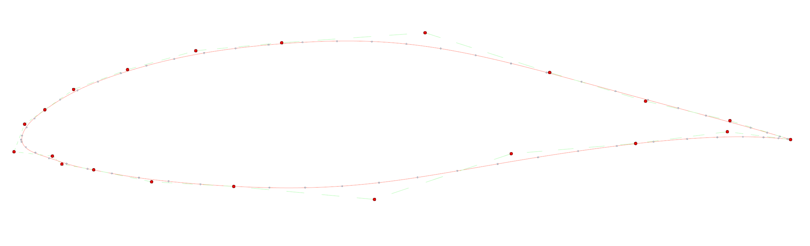
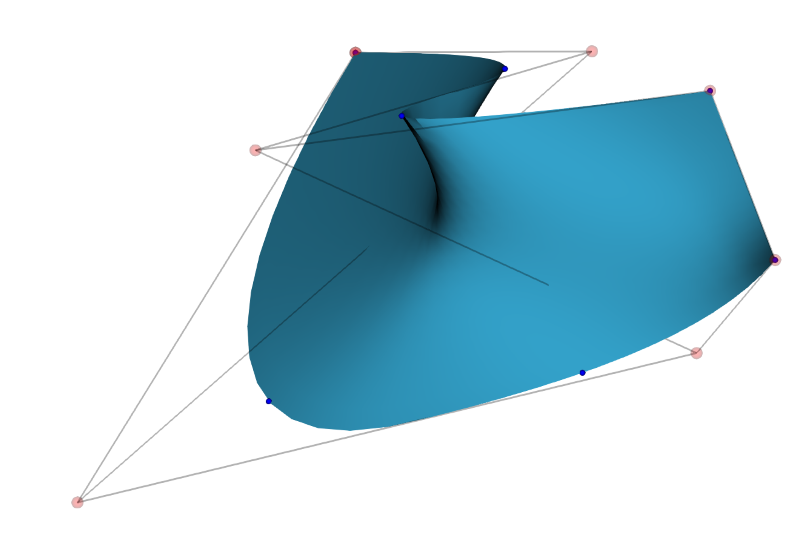
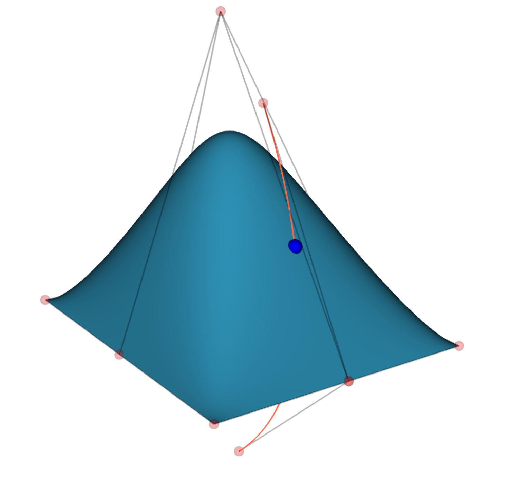

GBS is header library for computing bspline curves and surface.

GBS is compatible with OpenCASCADE, curves and surfaces can be converted to OpenCASCADE's objects.

__Example of point cloud approximation:__


__Example of points surface interpolation:__


__Example of curve-surface intersection:__


__Example of python code to interpolate points__
```python
    pts = [
        [0.,0.,0],
        [0.,0.,1],
        [1.,0.,0.5],
        [1.,1.,1]
    ]
    constrains = []
    for p in pts:
        constrains.append([p])

    degree = 2

    crv = gbs.interpolate_cn_3d_d(
        constrains,
        degree,
        gbs.KnotsCalcMode.CHORD_LENGTH
    )
```
For now, this lib is to be used inside a conda environment with the following package installed:
* nlopt 
* eigen3
* boost >= 1.74

The optional module gbs-occt requires the additional package:
* occt >=7.4.0

The optional module render requires the additional package:
* vtk >=9.0

The python biding requires the additional package:
* pybind11

The test library needs:
* gtest
* occt>=7.4.0
* sundials

**Warning tests relative to performances evaluation should be run in release mode**

As GBS base is a header library it doesn’t need compilation.

If one needs to compile the optional module gbs-occt, -DUSE_OCCT_UTILS:BOOL=TRUE shall be added to cmake command.
If one needs to compile the optional module render, -DUSE_RENDER:BOOL=TRUE shall be added to cmake command.
If one needs to compile the optional module python-binding, -DUSE_PYTHON_BIDING=TRUE shall be added to cmake command.

The full test suite, which require the optional module gbs-occt, please add -DGBS_BUILD_TESTS:BOOL=TRUE to the cmake command.
