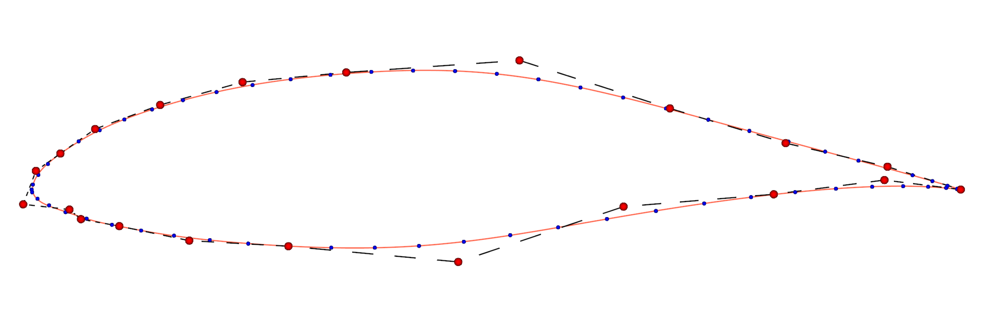
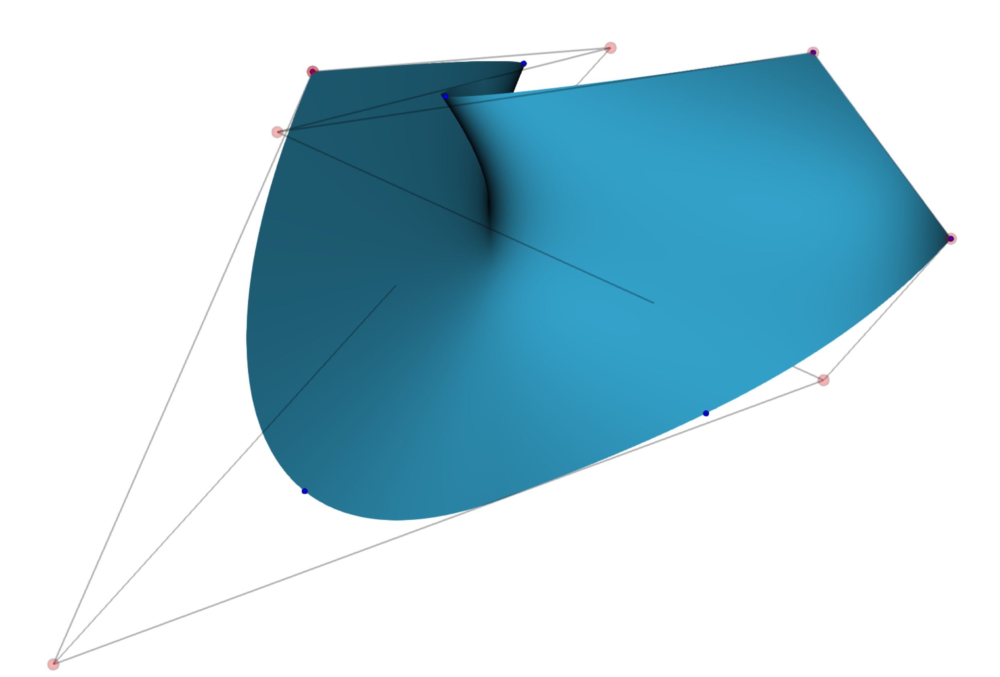
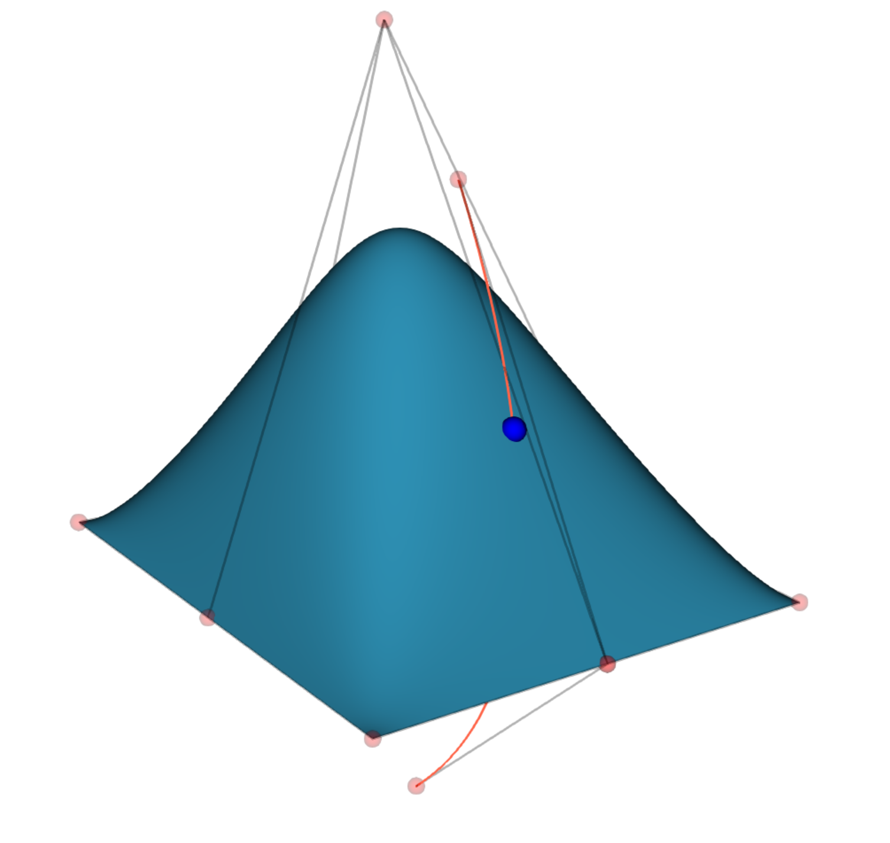
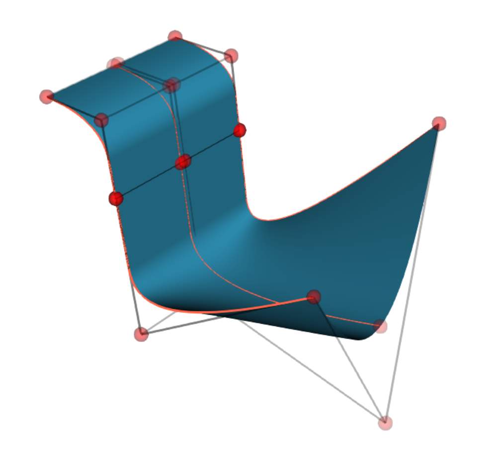
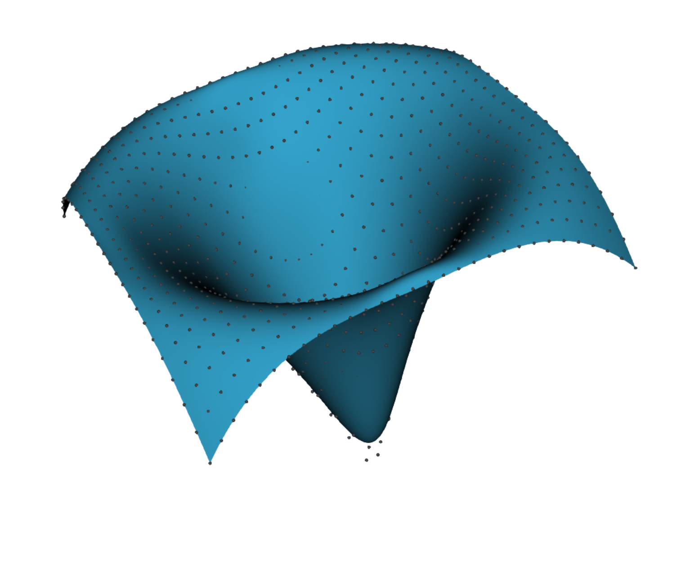
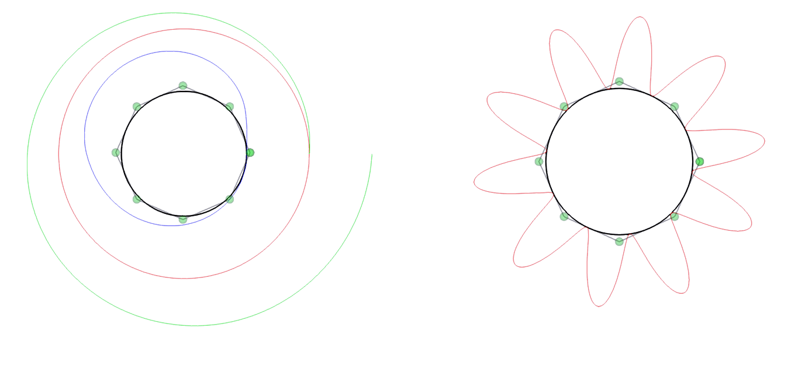
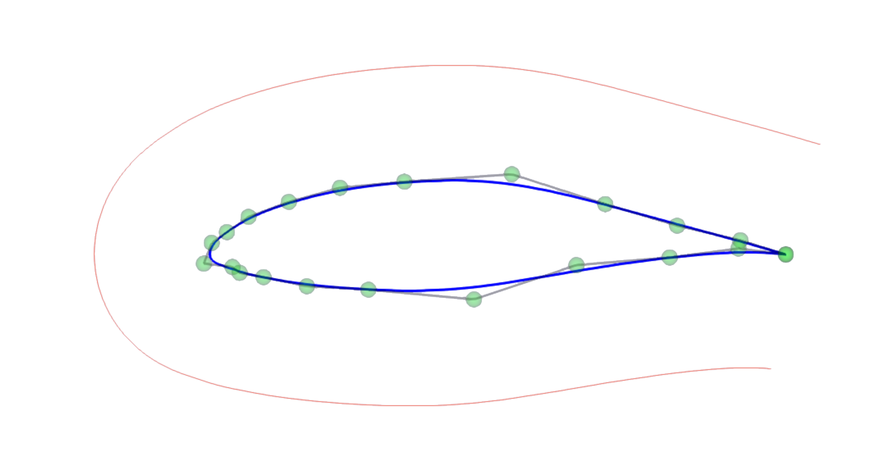
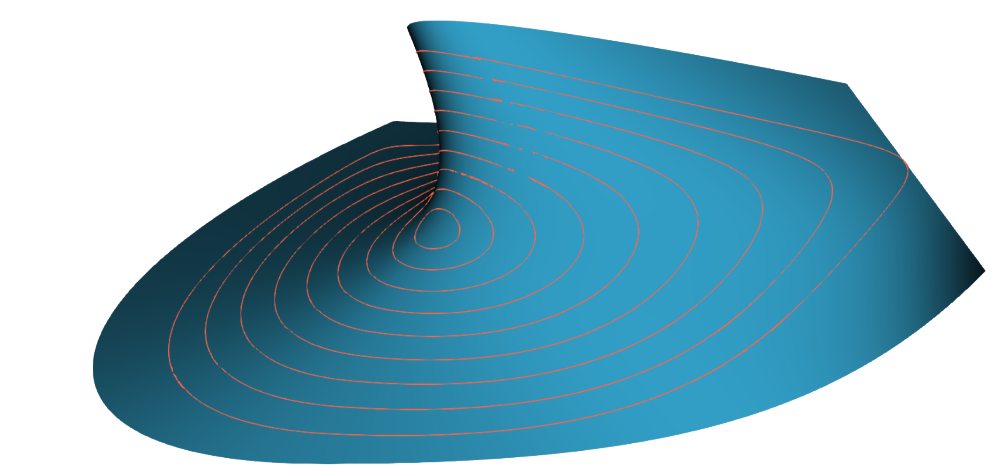

GBS is header library for computing bspline curves and surfaces.

GBS is compatible with OpenCASCADE, curves and surfaces can be converted to OpenCASCADE's objects.

__Example of point cloud approximation:__


__Example of points surface interpolation:__


__Example of curve-surface intersection:__


__Example of loft-surface creation:__


__Example of surface approximation of points:__



__Example of curve 2d variable offset:__



__Example of curve on surface:__


__Example of python code to interpolate points__
```python
    pts = [
        [0.,0.,0],
        [0.,0.,1],
        [1.,0.,0.5],
        [1.,1.,1]
    ]
    constraints = []
    for p in pts:
        constraints.append([p])

    degree = 2

    crv = gbs.interpolate_cn_3d_d(
        constraints,
        degree,
        gbs.KnotsCalcMode.CHORD_LENGTH
    )
```
GBS is packaged on conda-forge (recipe maintained in [gbs-feedstock](https://github.com/conda-forge/gbs-feedstock)):
``` bash
conda install -c conda-forge gbs
```

To build from source, use a conda environment (channels conda-forge + ssg-aero) with:
* cmake >= 3.28, ninja
* eigen >= 3.3.9, nlopt, libboost-devel, rapidjson, tbb-devel, libiges

The optional module render requires the additional package:
* vtk >= 9.0

The python bindings requires the additional packages:
* pybind11, numpy, pyvista

The optional module gbs-occt requires the additional package:
* occt (7.x or 8.x)

The test suite needs:
* doctest (C++ tests), pytest (Python tests)

**Warning tests relative to performances evaluation should be run in release mode**

As GBS base is a header library it doesn’t need compilation.

If one needs to compile the optional module gbs-occt, -DGBS_USE_OCCT_UTILS:BOOL=TRUE shall be added to cmake command.
If one needs to compile the optional module render, -DGBS_USE_RENDER:BOOL=TRUE shall be added to cmake command.
If one needs to compile the optional module python-bindings, -DGBS_USE_PYTHON_BINDINGS=TRUE shall be added to cmake command.

The test suite is built with -DGBS_BUILD_TESTS:BOOL=TRUE (see `.github/workflows/ci.yml` for the reference configuration).
